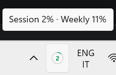
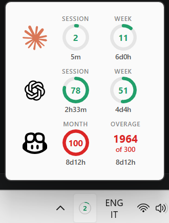
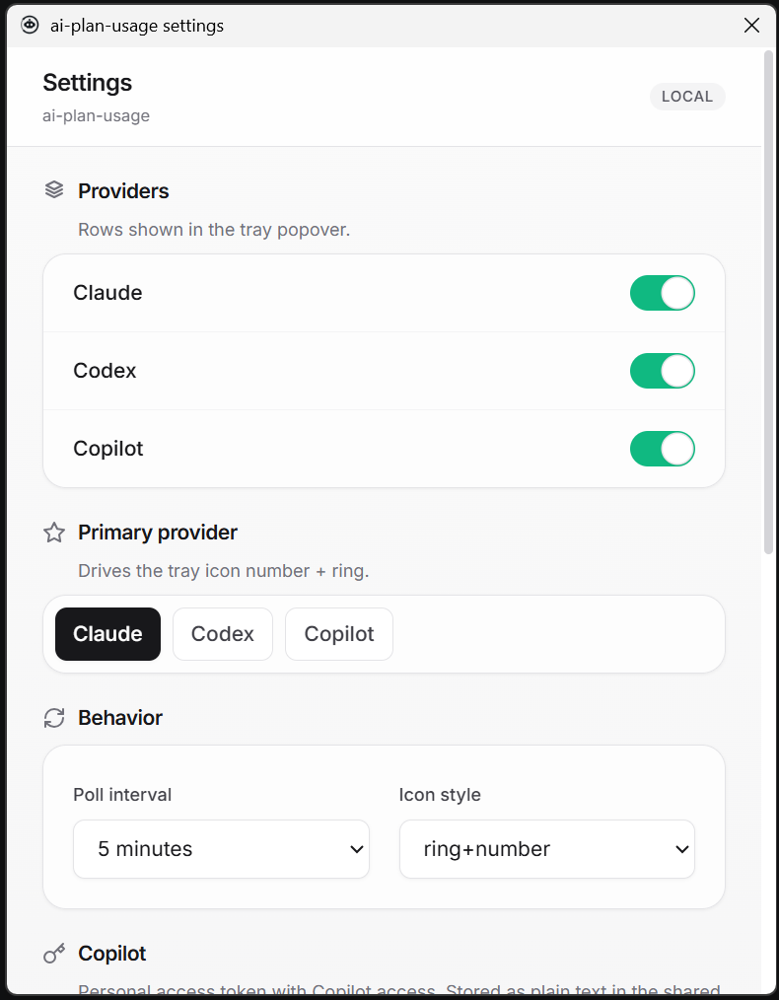

<p align="center">
  
</p>

<h1 align="center">ai-plan-usage</h1>

<p align="center">
  A small Windows tray app for Claude, Codex, and GitHub Copilot plan usage.
</p>

<p align="center">
  Minimal interface. Local data. No dashboards. No terminal workflow for checking usage.
</p>

## Why

`ai-plan-usage` is for people who use AI plans every day and just want to monitor how much of their plan they got left.

It stays out of the way, lives in the tray, and shows only the usage signals that matter:

- Claude session and weekly usage
- Codex session and weekly usage
- GitHub Copilot monthly usage and overage
- reset countdowns
- a dynamic tray icon for the provider you care about most

Daily use is handled through the UI. Click the tray icon, check the popover, adjust settings when needed, and get back to work.

## Easy Tray Readout

The tray icon shows the selected primary provider at a glance. The number and ring are designed for quick checking, and the tooltip gives the current session and weekly percentages without opening a full window.

<p align="center">
  
</p>

## Compact Usage Popover

The popover shows each enabled provider in one compact view. Claude and Codex show session and weekly usage; Copilot shows monthly usage and overage. Reset countdowns are visible where they matter.

<p align="center">
  
</p>

## Simple Settings

Settings are plain and practical: toggle providers, choose the primary provider, set the polling interval, change the icon style, and configure Copilot access from the UI.

<p align="center">
  
</p>

## Features

- **Claude, Codex, and GitHub Copilot** usage in one tray app.
- **Provider toggles** so the popover only shows what you use.
- **Primary provider selection** for the tray icon number and ring.
- **Configurable refresh interval** with a 5 minute default.
- **Local settings** under `%APPDATA%\ai-plan-usage\`.
- **Pace-aware coloring** for the tray icon and popover (see `docs/coloring.md`).
- **No hosted backend** for your usage data.
- **No analytics dashboard** or historical reporting layer.

## Run

The Tauri app is the main build.

```powershell
cd apps/ui
npm install

cd ..\tauri
npm install
npm run dev
```

Electron is kept as a fallback/reference shell.

```powershell
cd apps/electron
npm install
npm start
```

## Build

Build the Tauri app:

```powershell
scripts\build-tauri.ps1
```

Build the Electron app:

```powershell
scripts\build-electron.ps1
```

Build both:

```powershell
scripts\build-all.ps1
```

Build outputs are mirrored into `artifacts/`.

## GitHub Actions

The desktop build workflow runs on `windows-latest` so both shells produce real Windows `.exe` files without Linux cross-compilation setup.

- Every push, pull request, and manual run uploads a `windows-desktop-exes` artifact.
- Tags that start with `v` also create or update a GitHub Release and upload the Tauri and Electron `.exe` files.
